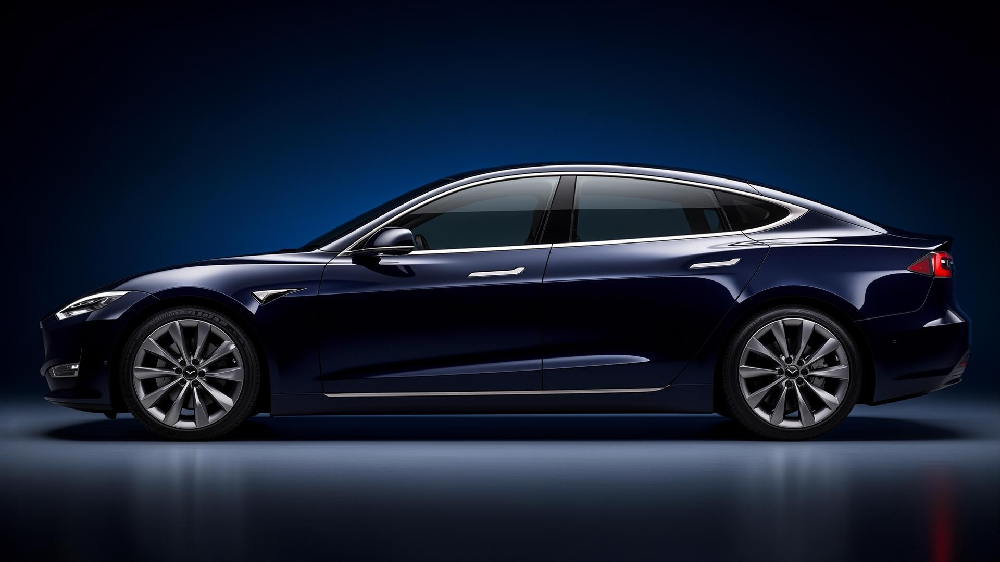

# Voltra ⚡



VOLTRA - Premium Electric Mobility Indonesia

## ✨ Features

- 🚗 Electric vehicle showcase
- 🔋 Battery technology
- 🌿 Eco-friendly mobility
- 💡 Innovation in transportation
- 🇮🇩 Proudly Indonesian

## 🛠️ Tech Stack

- HTML5
- CSS3
- JavaScript

## 🚀 Quick Start

```bash
# Clone the repository
git clone https://github.com/antono4/voltra.git

# Open in browser
cd voltra
open index.html
```

## 📁 Project Structure

```
voltra/
├── index.html      # Main page
├── css/            # Stylesheets
├── js/             # JavaScript files
└── assets/         # Static assets
```

## 🇮🇩 About Voltra

Voltra is dedicated to bringing premium electric mobility solutions to Indonesia. Our mission is to accelerate the adoption of electric vehicles for a sustainable future.

## 👤 Author

**Antono4**
- GitHub: [@antono4](https://github.com/antono4)

## 📄 License

This project is open source and available under the [MIT License](LICENSE).
